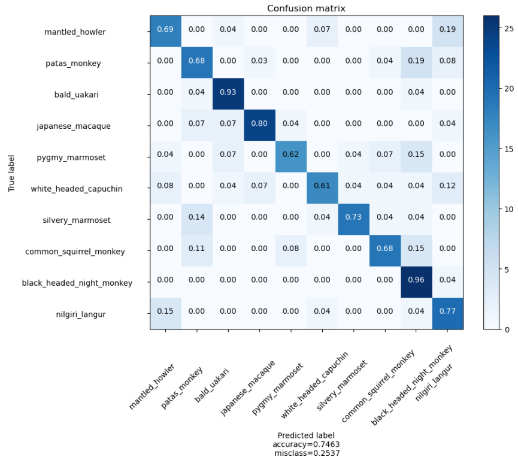
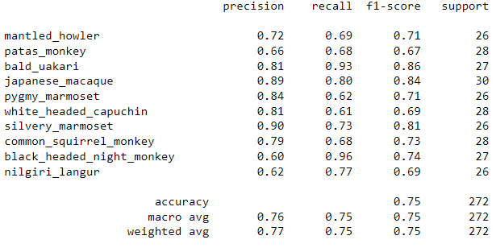

# Model Card

The model analysed in this card attempts to classify pictures of monkeys into one of ten species. The model only aims to classify into those ten species, and will not identify a number of monkeys or if multiple species are present.

## Model Description

**Input:** RGB image 

**Output:** A label of one of 10 monkey species:

- Mantled Howler
- Patas Monkey
- Bald Uakari
- Japanese Macaque
- Pygmy Marmoset
- White Headed Capuchin
- Silvery Marmoset
- Common Squirrel Monkey
- Black Headed Night Monkey
- Nilgiri Langur

**Model Architecture:** CNN tuned for fine-grain classification i.e. to differentiate slight variants on the same type of object.

## Performance

The model achieved an accuracy of around 75%, with some species achieving a very high idnetification rate of 95%.

## Limitations

**Multiple Monkeys:** Multiple monkeys being present in a single image will hinder identification.
**Blurry Images:** Low quality images with blur or motion will have a higher rate of misclassification.
**High Resolution Images:** The model resizes any image down to a common size
**Low Resolution Images:** Images of too low a resolution will not be identifiable
**Other species:** This model will label mislabel any other species of monkey, and has no label to indicate that it might be another species.